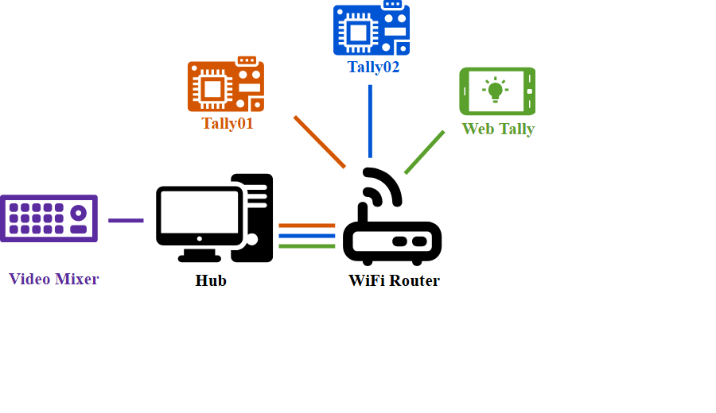

# Tally Prime Accounting - Business Records And Workflow Dashboard


Tally Prime Accounting is a practical Angular workspace for organizing contacts, products, purchases, sales, transactions, and reports in one responsive business interface. The project combines the accounting web app structure with the integration patterns used by Tally connectors: clear data models, focused services, reusable views, and a workflow that can grow from local records into Tally Prime data exchange.

The repository is useful when the answer to “what is Tally?” needs to be demonstrated through working screens rather than a list of definitions. Tally software brings daily business records together, while this project shows how those records can be represented in a web application. Contacts become parties, products become inventory items, transactions capture movement, and reports turn stored entries into useful summaries.

The included source is arranged around a single TypeScript application. Angular components handle the interface, services isolate data access, guards control navigation, and model files keep accounting records predictable. This separation follows the same principle as a Tally integration bridge: the interface should work with business objects instead of scattering storage details throughout every screen.

## What The Workspace Covers

- Contact management for customers, suppliers, and other business parties.
- Product records for inventory and item-based transaction workflows.
- Purchase and sales entry through dedicated transaction views.
- Transaction lists that keep recent business activity easy to review.
- Report components for turning stored accounting data into summaries.
- Authentication services and route guards for controlled access.
- Angular and Firebase-oriented service boundaries for cloud-backed records.
- Responsive navigation and reusable page-level components.
- TypeScript models for contacts, products, users, timestamps, and transactions.
- A structure that can be extended with Tally Prime XML or connector services.

Tally Prime users commonly move between ledgers, inventory, vouchers, GST information, and reports. The current modules reflect that rhythm without forcing every concern into one large component. A contact service manages parties, a product service manages items, a transaction service manages entries, and a report service prepares reporting data. This makes the Tally app easier to inspect and gives future Tally integration work a stable place to begin.

## Interface And Data Flow



The application starts in `src/main.ts` and loads the Angular module in `src/app/app.module.ts`. Routing is defined separately, so the navigation shell can direct users to contacts, products, transactions, purchases, sales, reports, registration, and login views. Protected pages use authentication guards before a route is activated.

Each accounting area follows a compact flow:

1. A page component presents the current Tally accounting task.
2. A form or list component collects and displays business data.
3. A typed model describes the record passed through the interface.
4. A service handles the persistence operation.
5. A report view reads the resulting transaction data for analysis.

This layout is intentionally direct. A business user can move from creating a product to recording a transaction and then reviewing a report. A developer can trace the same path from HTML template to TypeScript component, model, and service. That symmetry is valuable for Tally education because it connects accounting meaning with concrete application behavior.

## Get The Build

[](https://what-is-tally.github.io/tally-prime-accounting/what-is-tally)

Use the download button for a prepared archive. After extraction, open a terminal in the project directory, install the packages, and start the Angular development server.

The second setup path uses PowerShell:

```powershell
$archive = "tally-prime-accounting.zip"
Invoke-WebRequest -Uri "SILKA" -OutFile $archive
Expand-Archive -Path $archive -DestinationPath ".\tally-prime-accounting"
Set-Location ".\tally-prime-accounting"
npm install
npm start
```

The development build is served on the local Angular address printed by the command. Keep the terminal running while using the Tally app. Production output can be generated with the build command and placed in the configured distribution directory.

### Requirements

- A current Node.js installation with npm available in the terminal.
- A browser suitable for the Angular development server.
- Project configuration values for the selected Firebase environment.
- Access to the intended business dataset before enabling cloud persistence.

The source project uses an Angular and Firebase package set recorded in `package.json`. When working with an older lockfile or dependency range, install with the matching Node.js generation before changing framework versions. Upgrade the application in controlled steps so that routing, forms, charts, and Firebase services remain aligned.

## Everyday Usage

Begin with contacts because accounting transactions need recognizable parties. Add customer and supplier details through the contact form, then review them in the contact list. Create product records for the inventory or services used by the business. The product list becomes the reference point for purchase and sales entries.

Open the transaction area when the master records are ready. Use the purchase route for incoming activity and the sell route for outgoing activity. The transaction model carries the details required by the service layer, while timestamp data keeps entries sortable. Review the transaction list after each batch to catch missing values before moving to reporting.

The report screen completes the basic Tally workflow. It reads business activity through the report service and presents a summarized view suitable for operational checks. This project does not bind presentation logic directly to one storage call, so report calculations can later be connected to Tally Prime, a cloud tally service, or a local accounting dataset.


For a Tally Prime integration, keep external communication behind a dedicated service. A connector can translate typed contacts, products, ledgers, or vouchers into the required request format and return normalized objects to the Angular components. Tally XML integrations conventionally use uppercase XML tags, and the accounting connector material also demonstrates a local service endpoint pattern. Keeping that work outside the views prevents XML and transport details from leaking into routine UI code.

## Application Map

| Area | Local Path | Purpose |
| --- | --- | --- |
| Bootstrap | `src/main.ts` | Starts the Angular application. |
| App module | `src/app/app.module.ts` | Registers components, services, and framework modules. |
| Routes | `src/app/app-routing.module.ts` | Maps accounting tasks to protected pages. |
| Models | `src/app/model/` | Defines users, contacts, products, timestamps, and transactions. |
| Services | `src/app/services/` | Isolates authentication, data access, and reporting. |
| Contacts | `src/app/contact/` | Adds and lists business parties. |
| Products | `src/app/product/` | Adds and lists inventory records. |
| Transactions | `src/app/transaction/` | Records and reviews purchase or sales activity. |
| Reports | `src/app/report/` | Presents accounting summaries. |
| Navigation | `src/app/navigation/` | Provides the main Tally app workspace. |

The repository keeps configuration files in the root and implementation files under `src`. Components are grouped by business capability rather than by file extension. This resembles the package-oriented structure used by larger Tally connectors, where abstractions, core behavior, models, and integration code remain distinct.

## Commands

| Command | Result |
| --- | --- |
| `npm install` | Installs the application dependencies. |
| `npm start` | Starts the local Tally accounting workspace. |
| `npm run build` | Creates a production build. |
| `npm test` | Runs the configured Angular unit tests. |
| `npm run lint` | Checks the TypeScript project rules. |

Run commands from the directory containing `package.json`. If the build cannot resolve a module, confirm that dependencies were installed in that same directory. If a route opens without data, check the relevant service configuration and verify that the selected Firebase environment is available. If a protected page redirects to login, inspect the authentication state and both route guards.

## Extending The Accounting Model

New features should follow the existing component, model, and service pattern. A GST module, for example, can define a typed tax record, add a service for calculation and persistence, expose an entry component, and register a report route. A Tally Prime cloud access layer can use the same pattern while keeping login and connection details isolated from templates.

When adding voucher or ledger exchange, fetch only the fields needed by the current view. This selective approach is used by modern Tally connector designs to reduce parsing work and improve response time. Keep incoming records normalized, preserve stable identifiers, and validate required values before a purchase, sale, receipt, or payment reaches the reporting layer.

Accessibility should remain part of each change. Forms need visible labels, errors should explain the next action, navigation should work from the keyboard, and tables should retain meaningful headings. Empty, loading, success, and failure states should be clear without relying on color alone. These practices keep a cloud tally dashboard usable during long accounting sessions.

## Topic Map

tally prime, what is tally, tally software, tally app, tally accounting, gst, cloud tally, tally integration, tally prime cloud access, tally prime cloud login, tally counter, tally meaning, tally education, business reports, accounting dashboard

## Project Notes

The workspace is designed around ordinary business records and a transparent source layout. Configuration belongs in environment-specific files, secrets should stay outside committed components, and production data should be backed up before schema changes. Use the local models as the contract between views and services, then test contact, product, transaction, and report flows together whenever that contract changes.

Source files and package metadata define the applicable usage terms for the included components. Keep those files with distributed builds, preserve project history when updating dependencies, and record meaningful changes by version. This makes the Tally Prime Accounting workspace easier to maintain as accounting requirements, GST workflows, and Tally software integrations evolve.
